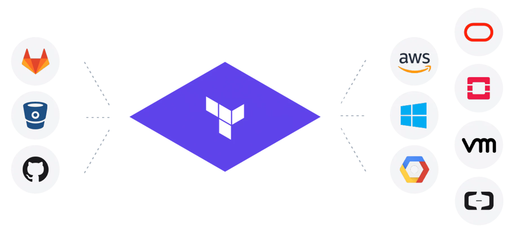

# Terraform-Multiple-Integrations
:sparkles::fireworks::tada: Important points about this Repository!!!!! :tada::fireworks::sparkles:

* This Repository will act as a reference/guide to explore Terraform and its providers.

* Codes in this Repository consists of various Terraform providers like AWS, Kubernetes, etc. There are many more Integrations to come in this Repository.

*  Each project in this Repository has been properly explained with comments.

# What is Terraform?

* Terraform is a provisioning tool.

* It is a part of DevOps World.

* Terraform is used to provide Infrastructure as a Code (IAAS).

* It is a Idempotent tool i.e. if your Infrastructure is already created, then even if we run the code again, it will not hamper the Infrastructure.

* It is so much powerful & Intelligent tool.

* It is capable of integrating almost all the big giant providers of services, & that list can be checked from [here!](https://www.terraform.io/docs/providers/index.html)

* A glimpse of the power of this tool is by running only command, it can create or destroy all the Infrastructure irrespective of how big the Infrastructure is.

# Running Terraform code!

* First of all Terraform should be installed in the system.

* To run the code, save the file with extension ".tf".

* Make a separate directory/folder for each Terraform script.

* In each directory first of all run this command "terraform init", this will download the Terraform plugins.

* Finally, to run the code, run the command "terraform apply".

* To destroy the environment created by Terraform, run the command "terraform destroy".

# License of this Repository!
To check out the License for this Repository please click [here!](LICENSE)